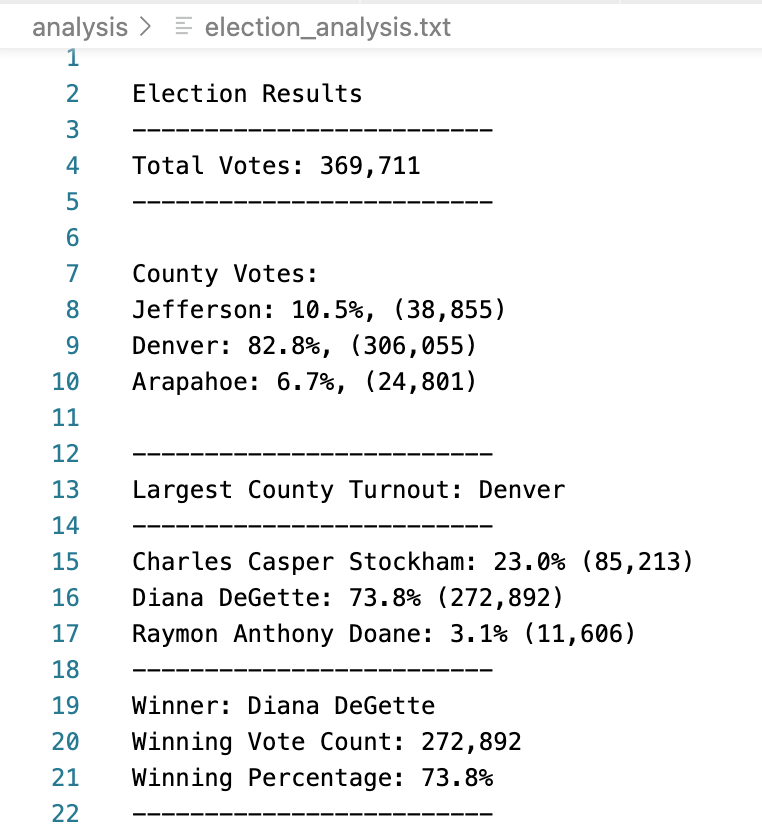

# Election Analysis

## Overview of Election Audit
A Colorado election board requested help to audit the results of a recent local congressional election. They requested that the following tasks be completed:

1. Determine the total number of votes cast in the election.
2. Provide a summary of the number of votes and percentage of total votes for each precinct in the county.
3. Calculate the county which had the highest voter turnout.
4. Provide a complete list of candidates who received votes.
5. Calculate the total number of votes each candidate received. 
6. Calculate the percentage of votes each candidate won.
7. Determine the winner of the election based on the popular vote.

## Resources
- Data source: election_results.csv
- Software: Python 3.9.12, Visual Studio Code 1.70.2

## Election Audit Results
The election analysis was completed by developing a python program to open and read the election_results source file and loop through each row (each ballot) to evaluate the county where the vote was recorded and the candidate who received the vote.  In the program, the audit results were then written to a file called election_analysis.txt.  The results of the audit are as shown in the image below of the contents of the election_analysis.txt file:



Each audit result presented above was calculated in the python program; some of which are described below:

We were able to tabulate the total vote by accumulating a total_vote variable as we evaluated or read each row of the file after the header:
```
    # For each row in the CSV file.
    for row in reader:
        # Add to the total vote count
        total_votes = total_votes + 1
```

While reading the row, we also identified the candidate who received the vote and the county where the vote was recorded:
```
        # Get the candidate name from each row.
        candidate_name = row[2]

        # 3: Extract the county name from each row.
        county_name = row[1]
```
We then use a conditional, like the one below, to create the list of candidates who received votes:
```
        if candidate_name not in candidate_options:

            # Add the candidate name to the candidate list.
            candidate_options.append(candidate_name)
```
We used a similar conditional to create the list of counties where votes were recorded.

Votes per candidate and per county were accumulated in a candidate votes dictionary and a county votes dictionary as we looped through each row of the file:
`candidate_votes[candidate_name] += 1` and `county_votes[county_name] += 1`
In this way, when we reached the last row of the file, we had a dictionary containing the candidates and the votes per candidate and a second dictionary with the counties and the voter turnout per county.

By looping through the keys in the dictionary, we could write the candidate's or county results, as shown below for the county results:
```
    # 6a: Write a for loop to get the county from the county dictionary.
    for county_name in county_votes:

        # 6b: Retrieve the county vote count.
        county_vote = county_votes.get(county_name)

        # 6c: Calculate the percentage of votes for the county.
        county_percentage = float(county_vote) / float(total_votes) * 100

        # 6d: Print the county results to the terminal.
        county_results = (f"{county_name}: {county_percentage:.1f}%, ({county_vote:,})\n")
        print(county_results)
```

While looping through each dictionary, we were also able to find the winning candidate (or county) with the largest number of votes:
```
        # 6f: Write an if statement to determine the winning county and get its vote count.
        if (county_vote > largest_turnout_vote):
           largest_turnout_vote = county_vote
```

## Election Audit Summary
This python program can be utilized to audit other elections, as long as the below items are taken into consideration:

1. This program assumes that a data file called 'election_results.csv' will be provided in a 'Resources' folder.
2. The format of the election_results.csv is expected to be fixed such that the first column contains ballot IDs, the second column contains the county or precinct, and the third column contains the candidate who received the vote.

If the source file name or location are different, it would be very simple to modify the program to accept a different source file name or location.
If the format of the source file is different, some more analysis would be needed, but it could still be possible that only small modifications would be required to accomodate those differences.
Finally, if the text accomodating the results was desired to read differently; for example by substituting 'precint' for 'county', that would also be able to be achieved with a simple modification to the program.

